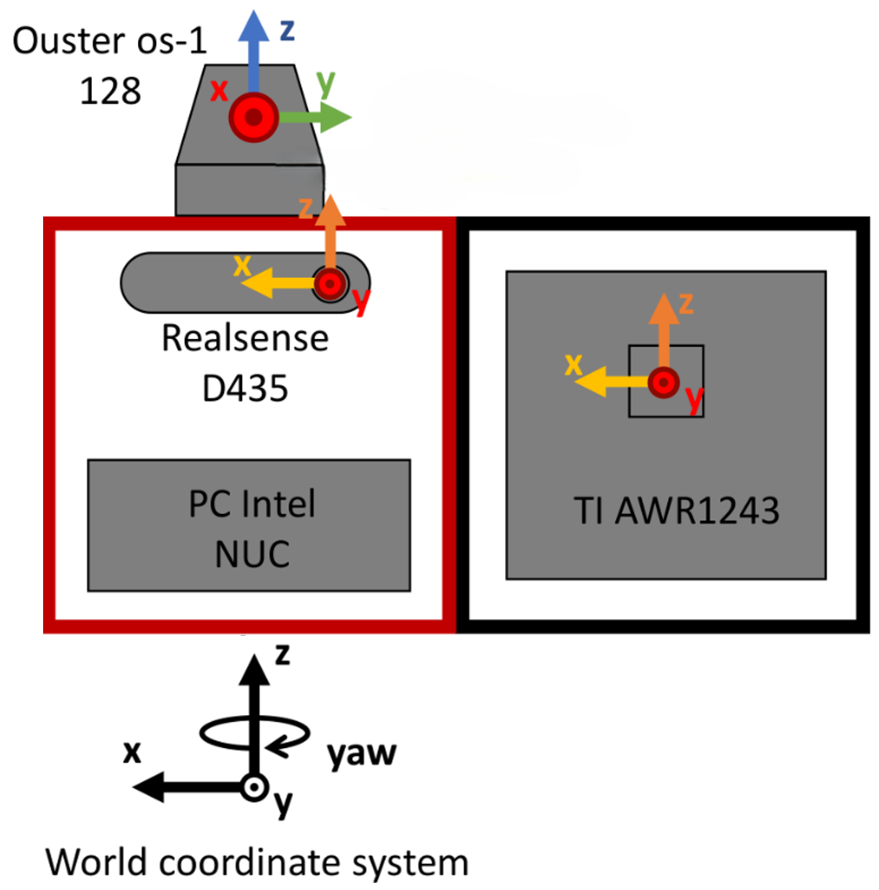
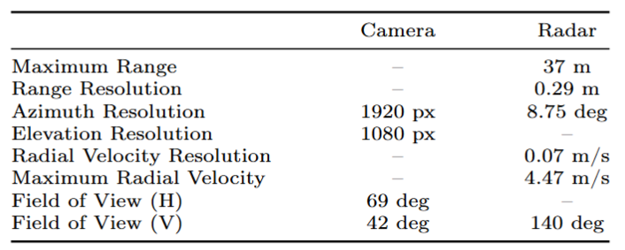

# Latest news:
- **07/07/2024: create repository**

# RadVRU dataset
RadVRU dataset is a collection of 2-hour of synchronized radar and RGB data in urban city environments. It contains 317 sequences of 10 s to 20 s in duration. Each sequence contains radar and RGB data recorded. There are approximately 77,000 frames with the two sensors synchronized. These frames are representative of the challenging driving scenarios, including different lighting conditions, complex traffic with cars, pedestrians, and cyclists.

# Sensor  specifications
<p align="center">
  
</p>
The acquisition hardware consists of a 77 GHz FMCW radar (TI AWR1243), a full HD RGB camera (Realsense D435), and a 3D LiDAR (Ouster OS1-128) mounted on the top of a vehicle. The world coordinate system is coupled to the EGO-vehicle and coupled to the Ouster os-1 lidar such that the world center is on the ground plane, directly below the lidar. The world yaw follows the compass heading convention with yaw=0 in the direction of travel of the car, increasing to the right. Their extrinsic parameters are provided together with the dataset. The sensors’ specifications are detailed in the table below.
<p align="center">
  
</p>

# Dataset structure
RadVRU folder contains 25 recorded sequences. Each sequence contains several sub-sequences. Each sub-sequence contains:
* The RAD radar cubes saved in a binary file with resolution [doppler, range, azi] = [128, 128, 16]. 
* The meta data that specifies the range, azimuth, and velocity bins.
* The camera data compressed in MJPEG format;
* Vision feed-forward array generated by using detections from [YOLOv8](https://github.com/ultralytics/ultralytics) with resolution [range, azi] = [128, 128].

```
RadVRU
├── realsense_20200916_19h26m02s_2997
│   ├── radar
│   │   ├── 0000
│   │   |   ├── rangebins.txt
│   │   |   ├── azimuthbins.txt
│   │   |   ├── velocitybins.txt
│   │   |   ├── Ramap000000
│   │   |   ├── Ramap000001
│   │   |   ├── ...
│   │   ├── 0001
│   │   ├── ...
│   ├── rgb
│   │   ├── 0000
│   │   |   ├── 000000.jpg
│   │   |   ├── 000001.jpg
│   │   |   ├── ...
│   │   ├── 0001
│   │   ├── ...
│   ├── vf
│   │   ├── 0000
│   │   |   ├── yoloOCCmap_000000.bin
│   │   |   ├── yoloOCCmap_000001.bin
│   │   |   ├── ...
│   │   ├── 0001
│   │   ├── ...
├── ...
```

We provide simple Python scripts to read and visualize the data.

# Labels
The annotations are performed by using a camera- and a LiDAR-based object detection model to pre-label the instances, and then these labels are manually corrected by human annotators. The pedestrians are annotated as single points on the ground plane. We provide Vulnerable Road User (including pedestrians and cyclists) ground truth for training and evaluation of detection algorithms. The ground truth consist of an frame ID, ground plane position. Labels are stored in a separated pickle file. We also provide the testing sequences used for evaluation.

# Download instructions
To download the dataset, please fill the [form](https://docs.google.com/forms/d/e/1FAIpQLSczBqxPVJ3k1r_FX4JA7GRQ3kyTQxjEt1B3E-j-0yHFmm1NmA/viewform?usp=sf_link) to obtain the download link.

# Citation
If you find this code useful for your research, please cite [our paper](https://...):
```
@InProceedings{Lee_2024_ECCV,
               author = {Lee, Wei-Yu and Dimitrievski, Martin and Van Hamme, David and Aelterman, Jan and Jovanov, Ljubomir and Philips, Wilfried},
               title = {CARB-Net: Camera-Assisted Radar-Based Network for Vulnerable Road User Detection},
               booktitle = {Proceedings of the European Conference on Computer Vision (ECCV)},
               year = {2024},
               }
```

# License
[](https://creativecommons.org/licenses/by-nc-sa/4.0/) [](https://opensource.org/licenses/BSD-2-Clause)

Please see [LICENSE.md](LICENSE.md) for more details.
